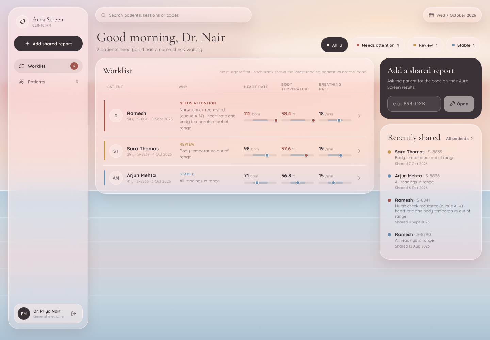
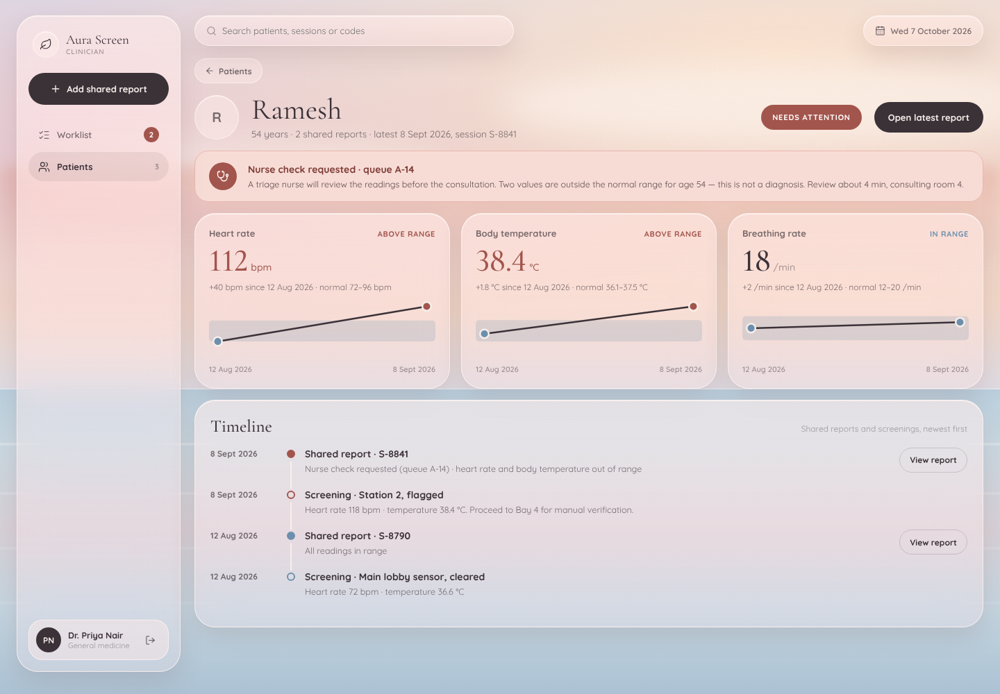
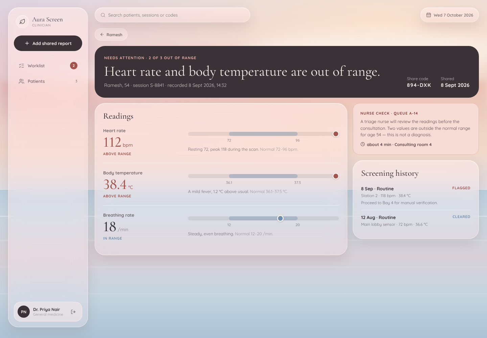
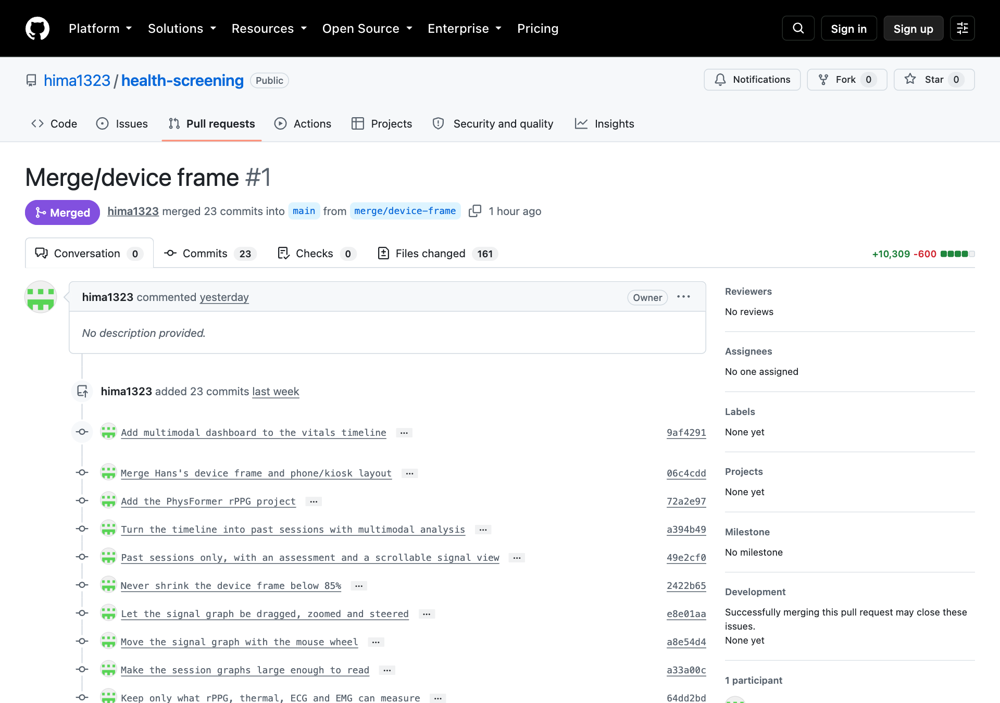
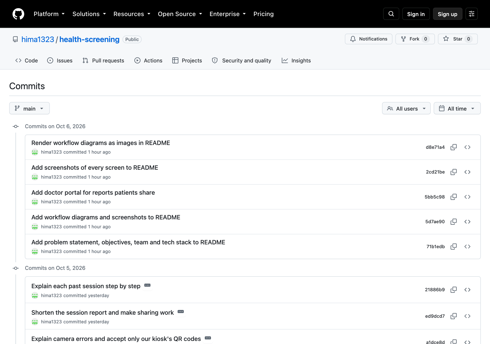

# Aura Screen — Patient App

Contactless biometric screening for patients: an introduction, an account, a
QR-triggered scan, and the report and timeline that come out of it. React +
Vite on the front, Express + Mongoose on the back — every screen reads its data
from MongoDB, nothing is hardcoded in the client.

## Problem statement

Routine health checks need a clinic visit, a trained operator and contact
sensors, so most people only get screened when something is already wrong.
A self-service kiosk can measure vitals without touching the patient: a camera
reads the pulse from the face (rPPG) and a thermal camera reads skin
temperature. The measurements are only useful if a patient with no medical
training can start a scan, understand the results and track them over time.
This project designs and builds that patient-facing side.

## Objectives

- Let a patient start a kiosk scan from their phone by scanning a QR code,
  with no operator present.
- Present each session's results (heart rate, temperature, ECG, EMG) in plain
  language, with a step-by-step explanation of how each value was measured.
- Show a timeline of past sessions so patients can see trends.
- Let patients share a report with their doctor.
- Apply HCI methods throughout: build (Lab 6), user testing (Lab 7), and
  improvements based on the test findings (Lab 8).

## Team members

| Name | Roll number |
|------|-------------|
| Himanshu | 2024AIB1007 |
| Hans | 2024AIB1011 |

## Technologies used

| Layer | Tools |
|-------|-------|
| Frontend | React 19, Vite, React Router, CSS Modules, lucide-react, jsQR (QR scanning) |
| Backend | Node.js, Express 5, MongoDB with Mongoose, JWT auth, Google sign-in, Multer (uploads) |
| Signal analysis | Python, NumPy; rPPG with POS/CHROM and a PhysFormer model in PyTorch (`rppg1/`) |
| Tooling | Git and GitHub, oxlint |

## Workflow

### Patient journey


### System architecture


### Starting a scan


## Screens

Captured from the running app, in the order a patient meets them.

### 1. Introduction and account

| Welcome · 1 of 3 | Welcome · 2 of 3 | Welcome · 3 of 3 | Create account |
|:-:|:-:|:-:|:-:|
|  |  |  |  |

### 2. Onboarding

| Your details + consent | Past reports (optional) | Scan Hub | How it works |
|:-:|:-:|:-:|:-:|
|  |  |  |  |

### 3. Contactless scan

| Kiosk shows a QR | Phone scans it | Active scan | ECG fallback | Capture complete |
|:-:|:-:|:-:|:-:|:-:|
|  |  |  |  |  |

### 4. Results and sharing

| Session report | Report, continued | Share with doctor |
|:-:|:-:|:-:|
|  |  |  |

### 5. Timeline and step-by-step analysis

| Past sessions | What this session shows | Steps 3–5 | Full analysis: thermal | Full analysis: signals |
|:-:|:-:|:-:|:-:|:-:|
|  |  |  |  |  |

### 6. Doctor portal


A doctor signs in separately and sees only the reports patients have shared with them, by share code.

| Worklist | Patient | Shared report |
|:-:|:-:|:-:|
|  |  |  |

- **Worklist**: patients most urgent first, filterable by triage. Each reading is a dot on its normal-range track, so out-of-range values stand out before any number is read.
- **Patient**: each measure's trend across shared reports, and one timeline of reports and screenings.
- **Shared report**: the verdict in words first, then every reading on its range, the nurse check and screening history.

## Version control

The project is tracked with Git and hosted on GitHub:
**https://github.com/hima1323/health-screening** (public).

### Branches

| Branch | Purpose |
|--------|---------|
| `main` | Stable code. This is what the GitHub page and the README show. |
| `merge/device-frame` | Working branch for the phone/kiosk device frame and later features. Merged into `main` through pull request #1. |

New work goes on a branch. It reaches `main` through a pull request, so every change to `main` can be reviewed and traced:

```bash
git switch -c feature/<name>          # start a branch
git add <files> && git commit         # one logical change per commit
git push -u origin feature/<name>     # publish it
gh pr create --base main              # open a pull request into main
```



### Commit conventions

- One logical change per commit, so any commit can be reverted on its own.
- The subject line says what the change does for the user, in the imperative
  ("Explain camera errors and accept only our kiosk's QR codes"), not which
  files changed.
- Code, docs and screenshots are committed. Secrets, build output and large
  data are not. `.gitignore` excludes `.env`, `node_modules/`, `dist/`,
  uploaded patient reports (`server/uploads/`), the rPPG datasets and model
  weights (`rppg1/data/`, `rppg1/checkpoints_mcd/`), screen recordings and
  voice notes.



### History

| Date | What changed | Commits |
|------|--------------|---------|
| 8 Sep 2026 | Initial patient app: React client, Express API, MongoDB models | `9923f1e`, `1d42a08` |
| 22 Sep 2026 | Patient accounts, onboarding and Google sign-in | `af8de42` |
| 29 Sep 2026 | Multimodal timeline dashboard, phone/kiosk device frame, PhysFormer rPPG project, past-session analysis with zoomable signal graphs, thermal frames | `9af4291` … `8efb1a1` (16 commits) |
| 30 Sep 2026 | Fewer sample reports, dates on session cards | `0b00956` |
| 5 Oct 2026 | Clearer camera errors, only the kiosk's own QR codes accepted, shorter session report with working sharing, step-by-step explanation of each past session | `a1dce8d`, `ed9dcd7`, `21886b9` |
| 6 Oct 2026 | Doctor portal for shared reports; README with problem statement, objectives, workflow diagrams and screenshots | `5bb5c98`, `71b1edb` … `d8e71a4` |

Run `git log --oneline` for the full list.

### Getting the code

```bash
git clone https://github.com/hima1323/health-screening.git
cd health-screening
```

Then follow [Run it](#run-it) below.

## Structure

```
webapp/
├── client/                 Vite React app (see client/README.md)
└── server/                 Express + Mongoose API
    ├── index.js            app entry — mounts the routers, connects, listens
    ├── db.js               mongoose connection
    ├── lib/                token.js (JWT), google.js (ID-token verification)
    ├── middleware/         requireUser.js — bearer token → req.user
    ├── models/             User, Patient, Station, ScreeningSession,
    │                       Report, VitalTimeline, ScreeningLog
    ├── routes/             api.js (screening data), auth.js (accounts)
    ├── scripts/seed.js     demo patient + session S-8841
    └── uploads/            past reports patients attach (gitignored)
```

## Run it

Needs MongoDB on `mongodb://127.0.0.1:27017`, or set `MONGODB_URI`.

```bash
# 1. configure and seed (once)
cd server && npm install && cp .env.example .env && npm run seed

# 2. API
npm start                       # http://localhost:4000

# 3. client, in a second terminal
cd ../client && npm install && npm run dev    # http://localhost:5173
```

After changing the analysis, rebuild the study sessions and reload just those —
`npm run sessions` leaves user accounts alone, so nobody gets signed out.
`npm run seed` also resets the demo patient, and keeps accounts too.

```bash
python3 analysis/build_sessions.py && (cd server && npm run sessions)
```

## Environment

`server/.env` — see `server/.env.example`.

| Variable | Needed for |
| --- | --- |
| `MONGODB_URI` | anything other than a local MongoDB |
| `JWT_SECRET` | signing sessions — set a long random string outside development |
| `GOOGLE_CLIENT_ID` | the Google sign-in button; the app falls back to email + password without it |
| `PORT` | moving the API off 4000 |

For Google sign-in, add `http://localhost:5173` to the OAuth client's
**Authorised JavaScript origins** in Google Cloud Console. No client secret is
needed — the browser gets the ID token and the server only verifies it.

## API

| Method | Path | Purpose |
| --- | --- | --- |
| `POST` | `/api/auth/register` · `/api/auth/login` | email + password accounts |
| `POST` | `/api/auth/google` | exchange a Google ID token for a session |
| `GET` | `/api/auth/me` | restore a remembered session |
| `PUT` | `/api/auth/me/profile` | onboarding details |
| `POST`/`DELETE` | `/api/auth/me/reports[/:id]` | attach or drop past reports |
| `GET` | `/api/primary` | resolve the signed-in patient and session ids |
| `GET` | `/api/patients/:id/scan-hub` · `/timeline` | screen data |
| `GET` | `/api/sessions/:sessionId/active-scan` · `/report` | screen data |
